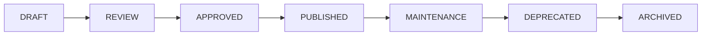

# Sprint Zero Documentation Organization Strategy
## Strategic Framework for Documentation Architecture

### Core Principle: The Evidence-Based Hierarchy
Like organizing case files in a major investigation, documentation must follow a clear chain of custody and accessibility pattern.

---

## Proposed Documentation Structure

```
/algocratic.github.io/
├── README.md                          [PRIMARY: Project overview]
├── CONTRIBUTING.md                    [PRIMARY: How to contribute]
├── ARCHITECTURE.md                    [PRIMARY: System design]
├── /docs/                             [CENTRAL EVIDENCE LOCKER]
│   ├── /sprint-zero/                  [CURRENT INVESTIGATION]
│   │   ├── inventory.md               [What exists]
│   │   ├── gaps-analysis.md           [What's missing]
│   │   ├── test-results.md            [What works]
│   │   ├── findings-report.md         [Executive summary]
│   │   └── recommendations.md         [Next steps]
│   ├── /technical/                    [TECHNICAL DOCUMENTATION]
│   │   ├── api-reference.md           [Function documentation]
│   │   ├── architecture.md            [System design]
│   │   ├── database-schema.md         [Data structures]
│   │   ├── deployment.md              [How to deploy]
│   │   └── security.md                [Security model]
│   ├── /user-guides/                  [USER DOCUMENTATION]
│   │   ├── getting-started.md         [New user guide]
│   │   ├── clearance-progression.md   [Level advancement]
│   │   ├── feature-guide.md           [How to use features]
│   │   └── troubleshooting.md         [Common issues]
│   ├── /design/                       [DESIGN DOCUMENTATION]
│   │   ├── style-guide.md             [Visual standards]
│   │   ├── component-library.md       [UI components]
│   │   ├── brand-guidelines.md        [Corporate identity]
│   │   └── accessibility.md           [A11y standards]
│   ├── /narrative/                    [WORLD DOCUMENTATION]
│   │   ├── world-bible.md             [Lore and setting]
│   │   ├── character-profiles.md      [Personas and roles]
│   │   ├── terminology.md             [Glossary]
│   │   └── timeline.md                [Event chronology]
│   └── /testing/                      [QUALITY DOCUMENTATION]
│       ├── test-plans.md              [What to test]
│       ├── test-results.md            [Test outcomes]
│       ├── bug-tracker.md             [Known issues]
│       └── performance.md             [Benchmarks]
├── /clearance/                        [EXISTING STRUCTURE]
│   └── [level]/README.md              [Level-specific docs]
└── /underground/archive/              [EXISTING ARCHIVE]
    └── README.md                      [Archive guide]
```

---

## Documentation Standards Framework

### 1. The Five W's Documentation Method
Every document must answer:
- **WHO**: Target audience (developer, user, instructor)
- **WHAT**: Content and scope
- **WHEN**: Last updated, review schedule
- **WHERE**: File location, related documents
- **WHY**: Purpose and business value
- **HOW**: Implementation details

### 2. Document Header Template
```markdown
# [Document Title]
## [Clearance Level] Documentation

**Document ID:** [AUTO-GENERATED]
**Last Updated:** [DATE]
**Review Status:** [PENDING|REVIEWED|APPROVED]
**Target Audience:** [Developer|User|Instructor|Administrator]
**Dependencies:** [Related documents]

### Executive Summary
[One paragraph overview]

### Table of Contents
[Auto-generated]

---
```

### 3. Documentation Lifecycle States


### 4. Review Cadence
- **Critical Docs:** Monthly review
- **Technical Docs:** Quarterly review
- **User Guides:** Bi-annual review
- **Narrative Docs:** Annual review

---

## Implementation Methodology

### Phase 1: Establish Base Camp (Week 1)
1. Create /docs/ directory structure
2. Move existing documentation to appropriate locations
3. Create placeholder files for critical gaps
4. Establish documentation templates

### Phase 2: Catalog Evidence (Week 2)
1. Complete comprehensive inventory
2. Document all file relationships
3. Create dependency maps
4. Identify orphaned content

### Phase 3: Fill Critical Gaps (Week 3)
1. Write main README
2. Document core JavaScript
3. Create architecture overview
4. Establish style guide

### Phase 4: Organize and Optimize (Week 4)
1. Cross-reference all documentation
2. Create navigation guides
3. Implement search functionality
4. Generate documentation index

---

## Documentation Quality Metrics

### Coverage Metrics
- **File Coverage:** % of files with documentation
- **Function Coverage:** % of functions documented
- **Feature Coverage:** % of features explained
- **Test Coverage:** % of tests documented

### Quality Metrics
- **Clarity Score:** Readability index
- **Completeness Score:** All sections filled
- **Accuracy Score:** Technical correctness
- **Currency Score:** How recent updates are

### Accessibility Metrics
- **Findability:** Time to locate information
- **Understandability:** Comprehension rate
- **Actionability:** Task completion rate
- **Maintainability:** Update frequency

---

## Documentation Governance

### Roles and Responsibilities
| Role | Responsibility | Authority |
|------|---------------|-----------|
| Documentation Owner | Overall strategy | Approve changes |
| Technical Writers | Create/update docs | Propose changes |
| Subject Matter Experts | Review accuracy | Validate content |
| Quality Reviewers | Check standards | Flag issues |
| Users | Provide feedback | Report gaps |

### Documentation Review Board
- Weekly reviews of new documentation
- Monthly gap analysis updates
- Quarterly strategy reviews
- Annual documentation audit

### Change Control Process
1. **Request:** Submit documentation need
2. **Triage:** Prioritize by impact
3. **Assignment:** Allocate to writer
4. **Creation:** Draft documentation
5. **Review:** Technical and editorial review
6. **Approval:** Sign-off by owner
7. **Publication:** Deploy to repository
8. **Notification:** Inform stakeholders

---

## Success Criteria

### Sprint Zero Success Metrics
- [ ] 100% of existing files cataloged
- [ ] All critical gaps identified
- [ ] Documentation structure established
- [ ] Standards framework approved
- [ ] Review process initiated

### Long-term Success Metrics
- [ ] 80% documentation coverage achieved
- [ ] Average time to find information < 2 minutes
- [ ] Documentation update lag < 1 sprint
- [ ] User satisfaction score > 4/5
- [ ] Zero critical undocumented features

---

## Risk Mitigation

### Documentation Debt Risks
| Risk | Probability | Impact | Mitigation |
|------|------------|--------|------------|
| Incomplete documentation | High | High | Mandatory doc reviews |
| Outdated information | Medium | High | Automated staleness checks |
| Inconsistent formatting | Medium | Medium | Enforce templates |
| Lost institutional knowledge | Low | Critical | Regular knowledge transfer |
| Documentation sprawl | Medium | Medium | Central repository |

---

*"In documentation, as in investigation, the truth is in the details."*
*- Detective Clive, Documentation Strategy Division*